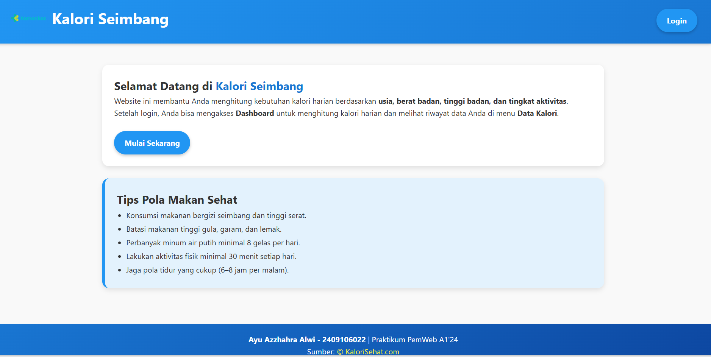
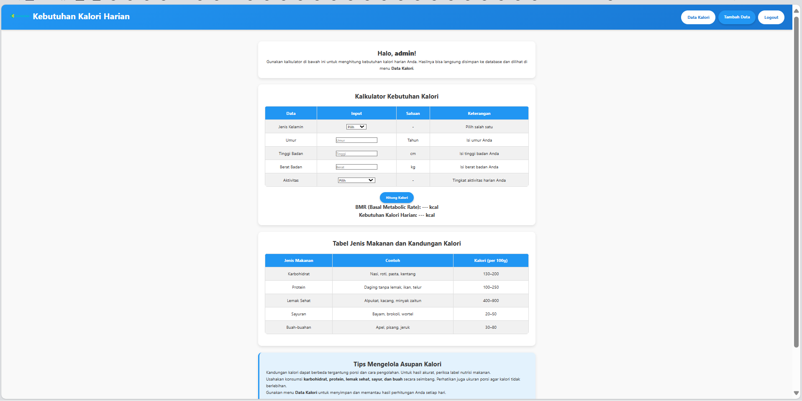
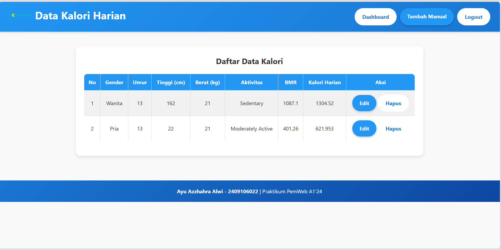

# 🌿 Aplikasi Web CRUD "Kalori Seimbang"

## 📘 Deskripsi Singkat
Aplikasi **Kalori Seimbang** adalah sistem web berbasis **PHP Native** yang digunakan untuk menghitung dan menyimpan **kebutuhan kalori harian (BMR & TDEE)** pengguna.  
Aplikasi ini dilengkapi dengan sistem **login, dashboard kalkulator, dan CRUD (Create, Read, Update, Delete)** untuk mengelola data hasil perhitungan.  
Dibuat sebagai tugas **Praktikum Pemrograman Web A1 2024** oleh **Ayu Azzhahra Alwi (2409106022)**.

---

## ✨ Fitur yang Tersedia
1. 🔐 **Login & Logout System** – autentikasi pengguna sebelum mengakses dashboard  
2. 🧮 **Kalkulator Kalori Harian (BMR & TDEE)**  
3. 💾 **Auto Save** – hasil hitung otomatis tersimpan ke database  
4. 📊 **CRUD Data Kalori** – tambah, tampil, ubah, dan hapus data  
5. 🧠 **Dashboard Interaktif** dengan perhitungan real-time menggunakan JavaScript  
6. 🎨 **Tampilan Responsif & Modern** menggunakan file `style.css`  
7. 🩺 **Tabel Data Kalori Harian** – menampilkan semua hasil perhitungan pengguna  

---

## 💻 Kebutuhan Sistem
| Komponen | Versi yang Disarankan |
|-----------|------------------------|
| OS | Windows 10 / 11 |
| Web Server | XAMPP / Laragon |
| PHP | Versi 8.0 atau lebih baru |
| Database | MySQL / MariaDB |
| Browser | Chrome, Edge, atau Firefox terbaru |

---

## ⚙️ Cara Instalasi

1. **Clone atau Download Repository**
```bash
git clone (https://github.com/ayuaa13/Tugas_WEB_CRUD)
```   
2. **Setup Database**, Buat database baru di MySQL :
   db_kalori.sql
   
3. **Konfigurasi Database**:

```php
<?php
$host = 'localhost';
$db   = 'db_kalori';
$user = 'root';
$pass = '';

try {
    $pdo = new PDO("mysql:host=$host;dbname=$db;charset=utf8", $user, $pass);
    $pdo->setAttribute(PDO::ATTR_ERRMODE, PDO::ERRMODE_EXCEPTION);
} catch (PDOException $e) {
    echo "Koneksi gagal: " . $e->getMessage();
}
?>
```
---

## 🗂️ Struktur Folder

```
📦 web-kemenkes-kalori
│
├── 📁 config
│ └── config.php
│ └── db_kalori.sql 
│
├── 📁 crud
│ ├── create.php 
│ ├── read.php 
│ ├── update.php 
│ ├── delete.php 
│ └── save_from_dashboard.php 
│
├── dashboard.php 
├── index.php 
├── login.php 
├── logout.php 
├── script.js 
├── style.css 
└── kemenkes.png 
```

---

## 🧾 Contoh Environment Config (config/config.php)

```php
<?php
$host = 'localhost';
$db   = 'db_kalori';
$user = 'root';
$pass = '';

try {
    $pdo = new PDO("mysql:host=$host;dbname=$db;charset=utf8", $user, $pass);
    $pdo->setAttribute(PDO::ATTR_ERRMODE, PDO::ERRMODE_EXCEPTION);
} catch (PDOException $e) {
    echo "Koneksi gagal: " . $e->getMessage();
}
?>
```
---

## 🖼️ Screenshot Aplikasi

### 🏠 Dashboard

*Gambar 1. Tampilan perhitungan kebutuhan kalori di Dashboard.*


### 📊 Data Kalori

*Gambar 2. Daftar hasil perhitungan kalori yang tersimpan di database.*

---

## 🛠️ Teknologi yang Digunakan

- **Backend:** PHP 8.0+ Native (tanpa framework/ORM)
- **Database:** MySQL/MariaDB dengan PDO
- **Frontend:** HTML5, CSS3
- **Design:** Modern UI dengan CSS Grid & Flexbox
- **Security:** Prepared Statements (PDO), htmlspecialchars() untuk XSS protection

---

## 👨‍💻 Developer

**Ayu Azzhahrah Alwi**  
NIM: 2409106022

---

## 📝 Lisensi
Proyek ini dibuat untuk keperluan pembelajaran dan tugas.

